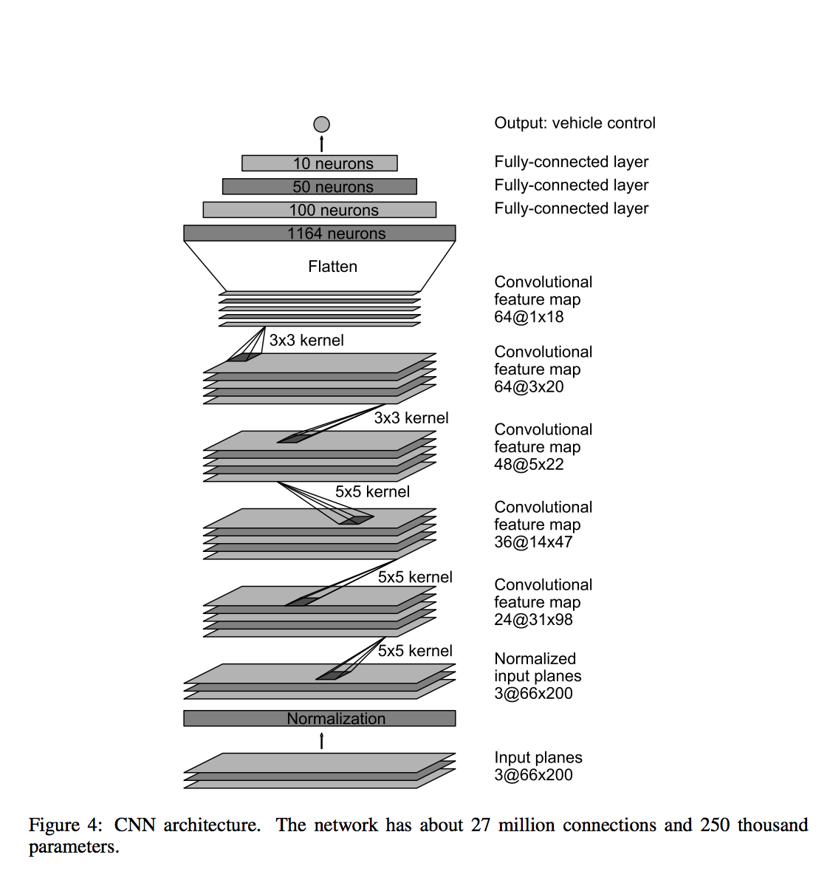

# Architecture of the network
The architecture of the network was taken from the nvidia paper referenced in the task.


```python
  model.add(Lambda(lambda x: x/127.5 - 1., input_shape=input_shape))
  model.add(Convolution2D(24, 5, 5, subsample=(2,2), activation='relu', name='Conv1'))
  model.add(Dropout(keep_prob))
  model.add(Convolution2D(36, 5, 5, subsample=(2,2), activation='relu', name='Conv2'))
  model.add(Dropout(keep_prob))
  model.add(Convolution2D(48, 5, 5, subsample=(2,2), activation='relu', name='Conv3'))
  model.add(Dropout(keep_prob))
  model.add(Convolution2D(64, 3, 3, activation='relu', name='Conv4'))
  model.add(Dropout(keep_prob))
  model.add(Convolution2D(64, 3, 3, activation='relu', name='Conv5'))
  model.add(Flatten())
  model.add(Dense(1164, activation='relu', name='FC1'))
  model.add(Dropout(0.4))
  model.add(Dense(100, activation='relu', name='FC2'))
  model.add(Dropout(0.3))
  model.add(Dense(50, activation='relu', name='FC3'))
  model.add(Dropout(0.2))
  model.add(Dense(10, activation='relu', name='FC4'))
  model.add(Dense(1, name='output'))
```

# Training approach

## Preprocessing
The track used to generate training data has a lot of straight segments and very shallow turns. Thus
the training data contains a lot of steering angles equal to zero. The images and steering angles
are therefore preprocessed.

The chosen preprocessing methods are all defined in the file `preprocessing.py`. The methods, among others,
include:
- randomly flipping the image and inverting the training angle as there is a mismatch between right and left turns on the track
- constrain the image to a region of interest, cutting off a large part of irrevelant image data at the top of the image
- shearing the image
- resizing the image

## training
The model architecture has been described above. The parameters used where found in trial and error, it was suprising to me
that such a small number of epochs - namely 8 - was sufficient to train a working model.
I've experimented with and without dropout in the model, including dropout lead to less overfitting.
As for the optimizer, I relied on the Adam optimizer with the same learning rate that worked well in the previous project.

# Conclusions
Due to the nature of the simulator, obtaining good training data was relatively hard. In the end, I turned to the dataset
released by udacity and a lot more image manipulation to achieve better generalization than previously thought.

For future improvements, there are a number of things that can be tried:
- use other/more image preprocessing techniques. one thing not applied here was gamma correction for example
- driving decisions such as the ones learned here might be also an interesting application for RNNs
