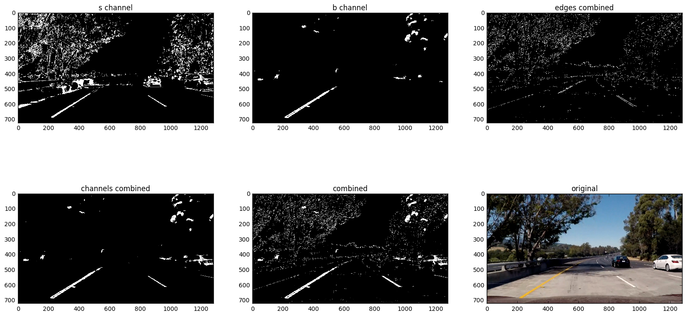

# Project 4 Advanced Lane Finding

## The pipeline
The pipeline consists of a number of steps, first of which is the camera calibration which is done
once as the very first step. The output is then reused in the later steps and applied to
every processed image. The camera calibration code is mostly based on the code used
in class material.

After camera calibration the following steps are taken for each image
- any distortion in the image is corrected using the data gathered in the very first step
- the image is transformed to a binary image where mostly the lanes are visible
- based on the binary image points are extracted to warp the image to a bird's eye view
- using those points, the image is warped to a bird's eye view perspective
- the lanes in the image are identified
- a polynomial is fit on the lane points
- the image is warped back
- the current lane is colored in the original image based on the extracted polynomials

## Details of the pipeline
### conversion to binary images
several filters were applied to the image and then combined to produce a binary image
highlighting mostly the lanes. Among the filters were:
- gradient magnitude
- gradient direction
- different color channels

Example application of the pipeline:

### extraction of points for warping the image to bird's eye view
to warp the image to bird's eye view lines in binary image were extracted using
a hough transform

### identifying lane pixels in a bird's eye view image
Identifying the pixels of lane lines in the bird's eye view images is done by identifying
peaks in a histogram representation of bands of the image.
A possible improvement here is to filter outliers detected in while sliding across the image. 

the output of the pipeline for the standard video can be found [here](https://youtu.be/wswqXJ_hMF4)

## Limitations of the pipeline
Applying the pipeline to the challenge video still produces acceptable results although
the identified lane is not as stable. At one point this is due to an irritation on
the road which looks like a straight line and is picked up by the transformation
instead of the real lane. Also the curvature information seems to be rather off. The
video can be found [here](https://youtu.be/ad9kQ8aixnc).

Applying the pipeline to the hard challenge video somehow fails to colour any part
of the road. Still investigating as to why that's happening.
